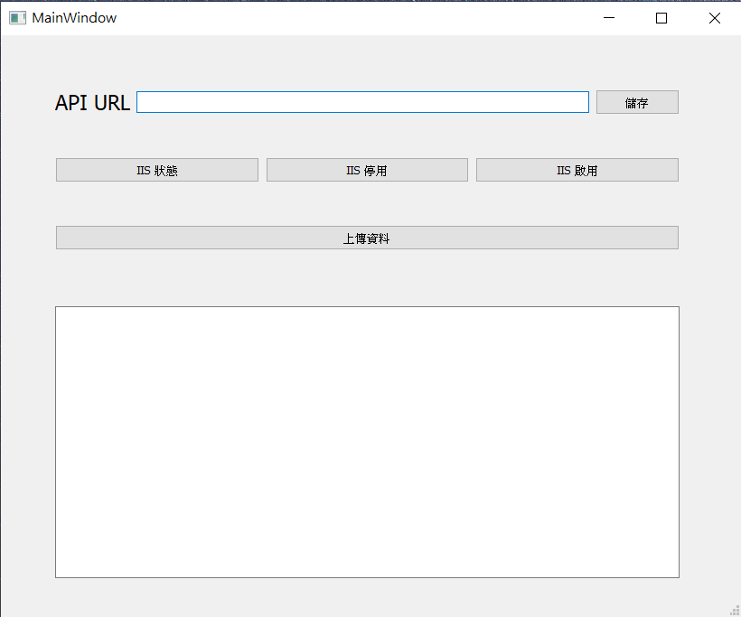
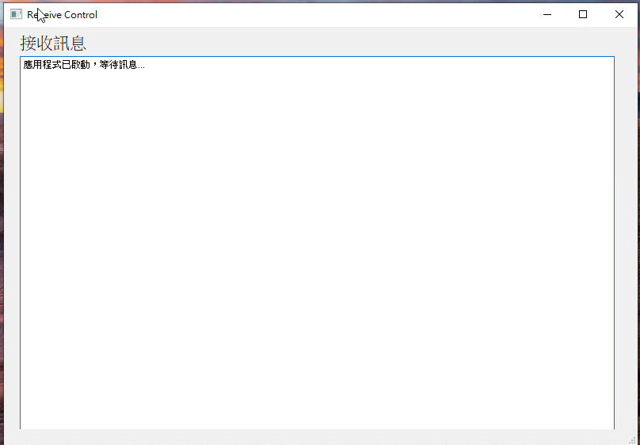

# IIS Deployment Tool




## Introduction
The **IIS Deployment Tool** is a Python-based solution designed to address the challenges faced during IIS deployment when projects are distributed across different local machines. This tool eliminates the need for Action Runners in automated deployment scenarios by offering a centralized and user-friendly approach for:

- Managing IIS services (start, stop, status checks)
- Uploading and organizing project files
- Streamlining deployment operations

## Features

1. **IIS Control**:
   - Start and stop IIS services.
   - Check the current status of IIS services.

2. **File Upload and Management**:
   - Upload project files and organize them into predefined directories.
   - Automatically back up existing files before deployment.

3. **Error Handling**:
   - Logs errors and activities to ensure traceability.
   - Displays meaningful messages to users through the GUI.

4. **System Tray Integration**:
   - The tool minimizes to the system tray, ensuring it doesn't obstruct other workflows.
   - Users can restore the window or exit the application via the tray menu.

5. **Centralized Deployment**:
   - Provides a single point of control for IIS deployments across multiple machines.

## Requirements

### Python Dependencies
Make sure you have the following Python modules installed:

- Flask
- PyQt5
- subprocess
- threading

Install dependencies using the following command:

```bash
pip install -r requirements.txt
```

### System Requirements
- Windows Operating System
- IIS (Internet Information Services) installed and configured

## Installation

1. Download the project files and extract them to a directory of your choice.

2. Navigate to the project directory:

```bash
cd <project-directory>
```

3. Install dependencies:

```bash
pip install -r requirements.txt
```

4. Run the main application:

```bash
python main.py
```

## Usage

### Starting the Tool
1. Run the `main.py` script to start the tool.
2. The main interface will display logs and messages about IIS service status and file uploads.

### Features in Detail

#### IIS Control
- Use the `/api/start-iis` and `/api/stop-iis` endpoints or GUI buttons to start or stop IIS services.
- Check the current status of IIS services via the `/api/status` endpoint.

#### File Upload
- Upload files to the configured deployment directory.
- Back up previous files to ensure recovery in case of issues.

### System Tray Integration
- Minimize the tool to the system tray.
- Restore the main window or exit the application using the tray menu.

## API Endpoints

### 1. **Check IIS Status**
   - Endpoint: `/api/status`
   - Method: `GET`

### 2. **Start IIS**
   - Endpoint: `/api/start-iis`
   - Method: `POST`

### 3. **Stop IIS**
   - Endpoint: `/api/stop-iis`
   - Method: `POST`

### 4. **Upload Files**
   - Endpoint: `/api/upload-files`
   - Method: `POST`
   - Body:
     - `files`: List of files to upload.

## Logging
- Logs are stored in the project directory under `app.log`.
- Logs include timestamps, client IPs, and detailed status updates for debugging and auditing purposes.

## Contributing
If you encounter issues or have suggestions for improvement, please submit a pull request or create an issue on the repository.

## License
This project is licensed under the MIT License.

---

**Developed to simplify IIS deployment and ensure seamless project transitions from local machines to production environments.**